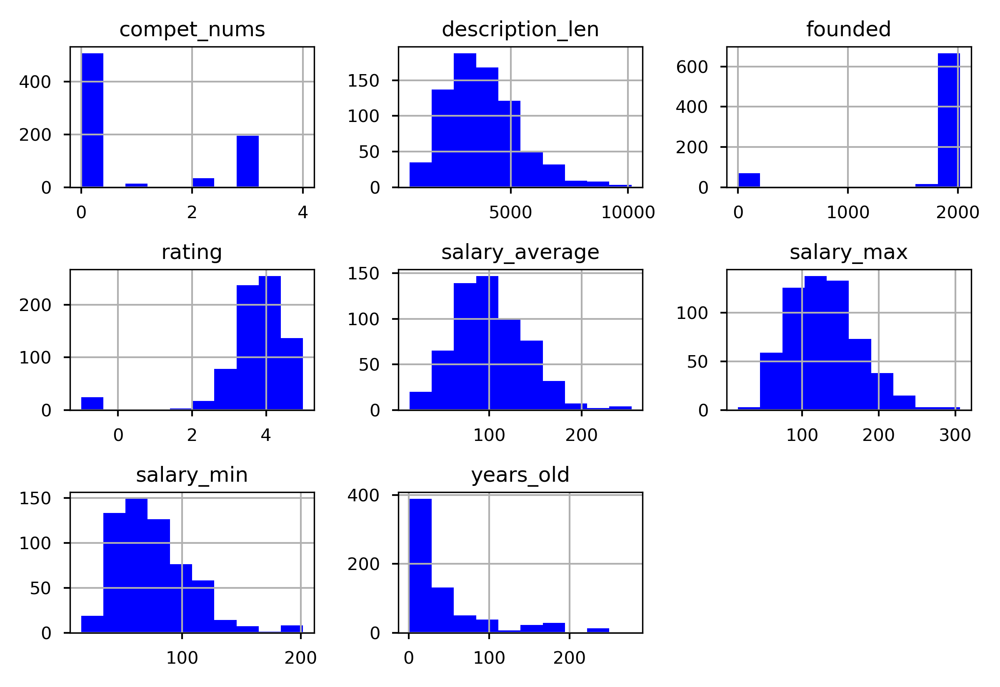
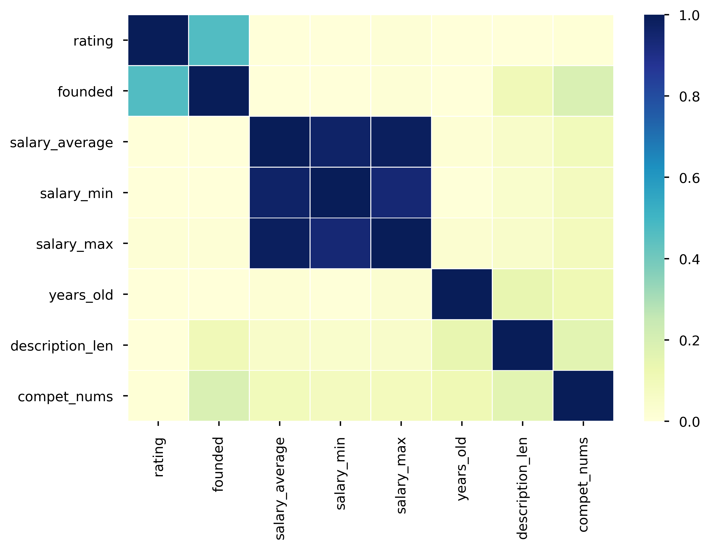
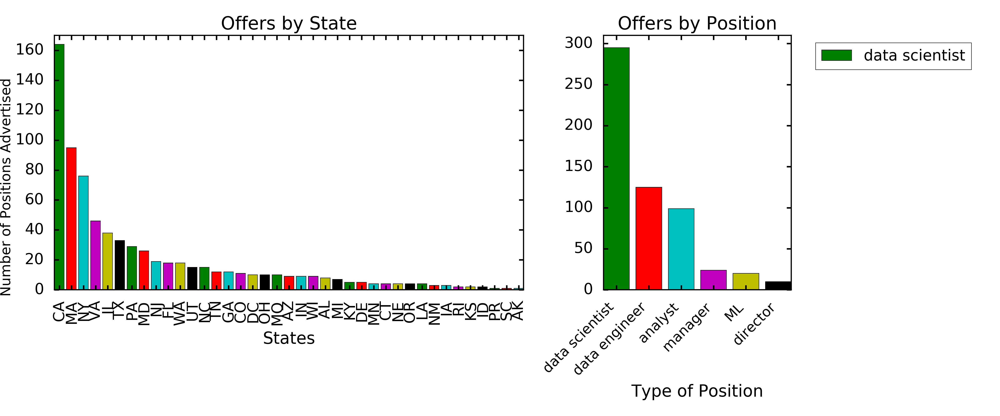

# Data Science Salary Estimator: Project Overview

* Created a tool that estimates data science salaries to help data scientists negotiate their income when they get a job.

* Scraped over 1000 job descriptions from glassdoor using python and selenium.

* Engineered features from the text of each job description to quantify the value companies put on python, excel, aws, and spark.

* Optimized Linear, Lasso, and Random Forest Regressors using GridsearchCV to reach the best model.

* Built a client facing API using flask

# Code and Resources Used

**Python Version**: 3.7

**Packages**: pandas, numpy, sklearn, matplotlib, seaborn, selenium, flask, json, pickle

**For Web Framework Requirements**: pip install -r requirements.txt

**Scraper Github**: https://github.com/arapfaik/scraping-glassdoor-selenium

**Scraper Article**: https://towardsdatascience.com/selenium-tutorial-scraping-glassdoor-com-in-10-minutes-3d0915c6d905

**Flask Productionization**:  https://towardsdatascience.com/productionize-a-machine-learning-model-with-flask-and-heroku-8201260503d2

**YouTube Project Walk-Through**: https://www.youtube.com/playlist?list=PL2zq7klxX5ASFejJj80ob9ZAnBHdz5O1t

# 1. Web Scraping

Tweaked the web scraper github repo (above) to scrape 1000 job postings from glassdoor.com. With each job, we got the following:

* Job title

* Salary Estimate

* Job Description

* Rating

* Company

* Location

* Company Headquarters

* Company Size

* Company Founded Date

* Type of Ownership

* Industry

* Sector

* Revenue

* Competitors

# 2. Data Cleaning

After scraping the data, I needed to clean it up so that it was usable for our model. I made the following changes and created the following variables:

* Parsed numeric data out of salary

* Made columns for hourly wages

* Removed rows without salary

* Parsed rating out of company text

* Made a new column for company state

* Added a column for if the job was at the company’s headquarters

* Transformed founded date into age of company

* Made columns for if different skills were listed in the job description:

   * Python
   * R
   * SQL
   * Excel
   * AWS
   * Spark
 
* Column for simplified job title and Seniority

* Column for description length

# 3. Exploratory Data Analyses (EDA)

Looked at the distributions of the data, value counts and correlation among the various categorical variables. Additionally a wordcloud was generated. Below are a few highlight figures.

# 4. Model Building
Categorical variables  were transformed into dummy variables. Data Wwas splitted into train and tests sets with a test size of 20%.

I tried three different models and evaluated them using Mean Absolute Error. I chose MAE because it is relatively easy to interpret and outliers aren’t particularly bad in for this type of model.

I tried three different models:

Multiple Linear Regression – Baseline for the model
Lasso Regression – Because of the sparse data from the many categorical variables, I thought a normalized regression like lasso would be effective.
Random Forest – Again, with the sparsity associated with the data, I thought that this would be a good fit.

**Model Performance**: 
* Ramdom Forest: MAE = 12.50
* Linear Regression: MAE = 17.83
* Lasso Regression: MAE = 18.70
Model performance

# 5. Productionization

In this step, I built a flask API endpoint that was hosted on a local webserver by following along with the TDS tutorial in the reference section above. The API endpoint takes in a request with a list of values from a job listing and returns an estimated salary.
